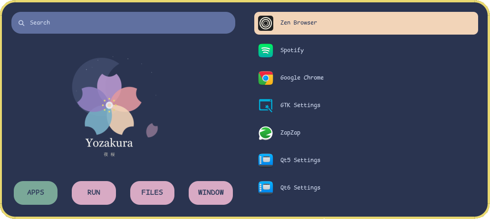
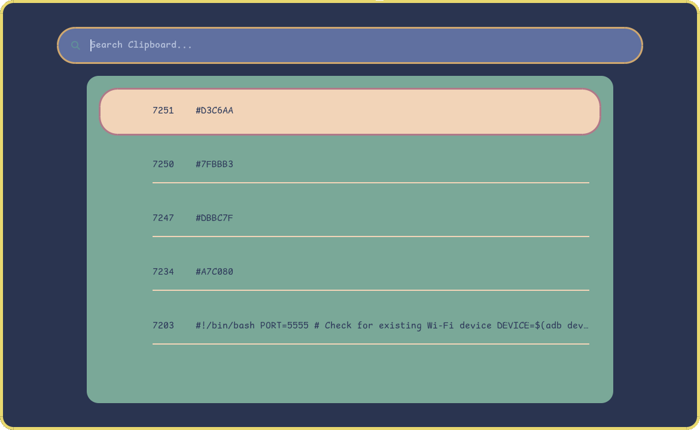
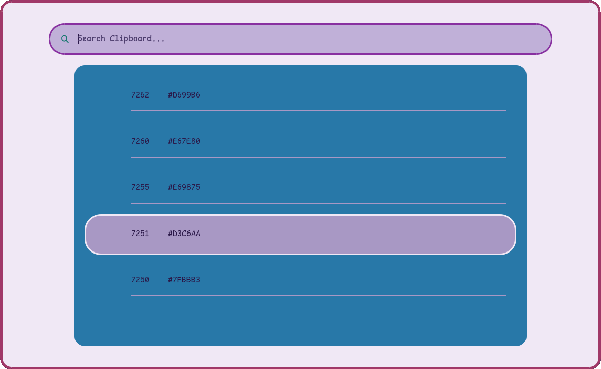
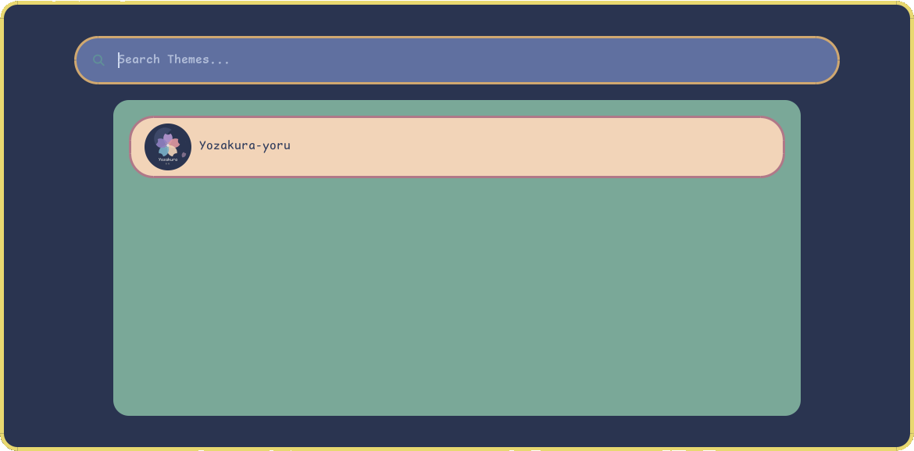

<div align="center">


# 夜桜 Yozakura — Rofi Theme

A handcrafted pastel color palette for [rofi](https://github.com/davatorium/rofi), based on the [Yozakura](https://shunsui18.github.io/yozakura) palette.

[](LICENSE)
[](https://github.com/davatorium/rofi)
[](install.sh)
[](https://github.com/shunsui18/yozakura)

</div>

---

## ✦ Flavors

| | Flavor | Description |
|---|---|---|
| 🌸 | **Yoru** *(night)* | Deep, moonlit background with soft sakura accents — default |
| ☀️ | **Hiru** *(day)* | Warm ivory canvas with gentle pastel tones |

<br>

### App Launcher

<table>
<tr>
<td align="center"><b>🌸 Yoru</b></td>
<td align="center"><b>☀️ Hiru</b></td>
</tr>
<tr>
<td></td>
<td></td>
</tr>
</table>

### Clipboard

<table>
<tr>
<td align="center"><b>🌸 Yoru</b></td>
<td align="center"><b>☀️ Hiru</b></td>
</tr>
<tr>
<td></td>
<td></td>
</tr>
</table>

### Theme Switcher

<table>
<tr>
<td align="center"><b>🌸 Yoru</b></td>
<td align="center"><b>☀️ Hiru</b></td>
</tr>
<tr>
<td></td>
<td></td>
</tr>
</table>

---

## ✦ Installation

### Interactive — One-liner

Run without any arguments to launch the guided menu:

```bash
bash <(curl -fsSL https://raw.githubusercontent.com/shunsui18/yozakura-rofi/main/install.sh)
```

The installer will walk you through picking a flavor and whether to back up your existing config:

```
  夜桜 Yozakura — Rofi Config Installer
  ────────────────────────────────────────

  Select a flavor:
  1) 🌸  Yoru  (night — deep moonlit palette)
  2) ☀️   Hiru  (day  — warm ivory canvas)

  Flavor [1/2] (default: 1): _

  Back up existing ~/.config/rofi?
  1) Yes  (saves current config to ~/.config/rofi.bak)
  2) No   (existing files will be overwritten)

  Backup [1/2] (default: 1): _
```

---

### Non-interactive — Flags

Skip the menu entirely by passing flags directly:

```bash
bash <(curl -fsSL https://raw.githubusercontent.com/shunsui18/yozakura-rofi/main/install.sh) --theme hiru --backup yes
```

| Flag | Values | Description |
|---|---|---|
| `--theme` | `yoru` \| `hiru` | Theme flavor to activate |
| `--backup` | `yes` \| `no` | Back up existing `~/.config/rofi` before installing |
| `-h`, `--help` | — | Show help |

---

### Manual Installation

If you prefer to clone and run locally:

```bash
# 1. Clone the repo
git clone https://github.com/shunsui18/yozakura-rofi.git && cd yozakura-rofi

# 2a. Interactive
bash install.sh

# 2b. Or with flags
bash install.sh --theme hiru --backup yes
```

---

## ✦ What the Installer Does

1. **Menu or flags** — launches an interactive prompt if no arguments are given, or skips straight to install when flags are provided
2. **Self-locates** — resolves its own path correctly whether run locally or via `bash <(curl ...)`
3. **Validates** — confirms the requested theme files exist before touching anything
4. **Optionally backs up** your existing `~/.config/rofi` to `~/.config/rofi.bak`
5. **Copies** all theme files into `$HOME/.config/rofi/`, creating the directory if needed
6. **Symlinks** `colors.rasi` to the selected flavor's color file, so switching themes updates all modules at once
7. **Fails gracefully** — descriptive error messages if arguments are invalid or a theme file is not found

---

## ✦ Modules

| Module | Description |
|---|---|
| **App Launcher** | Application launcher with icon support |
| **Clipboard** | Clipboard history browser via `cliphist` |
| **Theme Switcher** | Live toggle between Yoru and Hiru flavors |

---

## ✦ File Structure

```
yozakura-rofi/
├── assets/
│   ├── yozakura-yoru-rofi-app-launcher-preview.png
│   ├── yozakura-hiru-rofi-app-launcher-preview.png
│   ├── yozakura-yoru-rofi-clipboard-preview.png
│   ├── yozakura-hiru-rofi-clipboard-preview.png
│   ├── yozakura-yoru-rofi-theme-switcher-preview.png
│   └── yozakura-hiru-rofi-theme-switcher-preview.png
├── app-launcher/
│   ├── color-map.rasi
│   ├── icon.png
│   └── style.rasi
├── clipboard/
│   └── style.rasi
├── theme-switcher/
│   ├── color-map.rasi
│   └── style.rasi
├── styles/
│   ├── colors-yoru.rasi
│   └── colors-hiru.rasi
├── scripts/
│   ├── app-launcher-launch.sh
│   ├── clipboard-launch.sh
│   ├── theme-switcher-launch.sh
│   ├── theme-menu.sh
│   ├── change-window-background.sh
│   ├── cliphist-rofi-img
│   └── rofi-image-sync.sh
├── colors.rasi -> styles/colors-yoru.rasi
├── install.sh
├── LICENSE
└── README.md
```

---

<div align="center">

crafted with 🌸 by [shunsui18](https://github.com/shunsui18)

</div>
